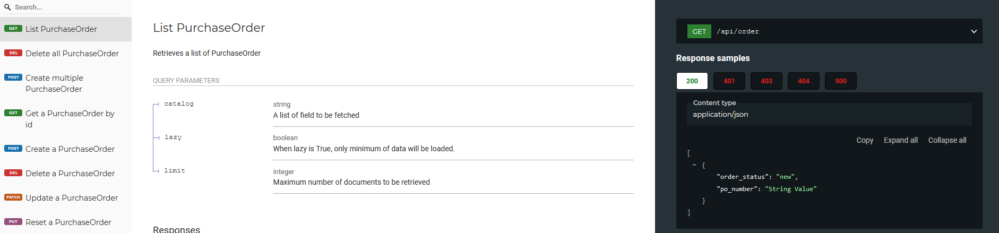
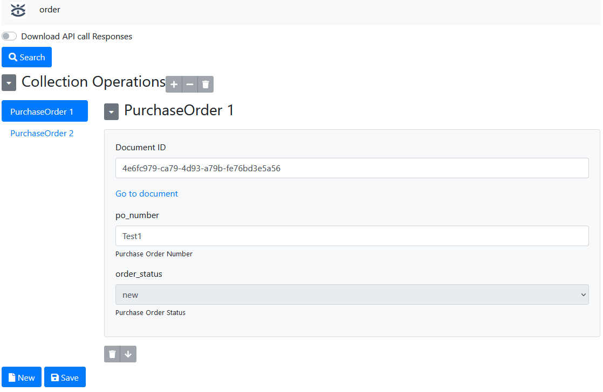

# X-I-A API Tutorial - 01
## Getting Started

Welcome to XIA API tutorial!

The goal of this tutorial is to quickly show you how to build a complex application by using X-I-A API framework. 
This framework is microservice based in order to get a fast learning curve for developers and AI.

## How to use this tutorial

Each tutorial is ended by a series number like 01-02-03. The longer the series is, the more advanced topic is discussed.
It will be better to finish basic tutorial before going through advanced ones. Each tutorial has example code. 
Installation instruction could be found at tutorial/install.md.

## Let's start !
### Data to API in 2 minutes

Once clone and deployed the example code (see [installation guide](tutorial/install.md) for instruction), three services are deployed:

* /doc: Auto-generated OpenAPI document



* /api: API Endpoint


* /: Frontend Editor



### Define your own data model

In order to use your own data model, you just need to focus on kernel code.

1. Adapting data models in models directory
2. Importing defined models into config.py
3. Defining resource mapping in config.py. 
```
    RESOURCE_MAPPING = { "order": PurchaseOrder }
```
For the above example, if you want to manipulate Python data model PurchaseOrder, you could use:
* /api/order for api call
* /order for web editing

### Other files:
* static/js/redoc.js: Presenting OpenAPI specification in web page
* compile.py: Used to compile static files from defined data models
* Dockerfile: build container
* main.py: Entry points
* requirements.txt, requirement-xia.txt: pip package dependencies

That is all what you need to make it work

### Next Step: Making your data persistent

Data Model use by default RamEngine which keeps data in Memory. 
In order to make your data persistent, you will need to change data engine. 
X-I-A is capable of working with any database. Please follow the next tutorial:
* Tutorial 02: Database Engine


### Going deeper on data model topic
* Tutorial 01-01: Using fields libraries
* Tutorial 01-02: How to describe complex data models (document in document / document relationships)
* Tutorial 01-03: Framework natively avoids over fetching and under fetching
